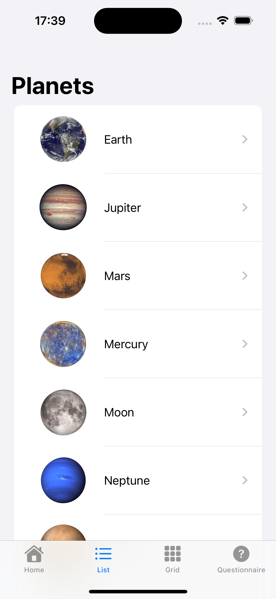
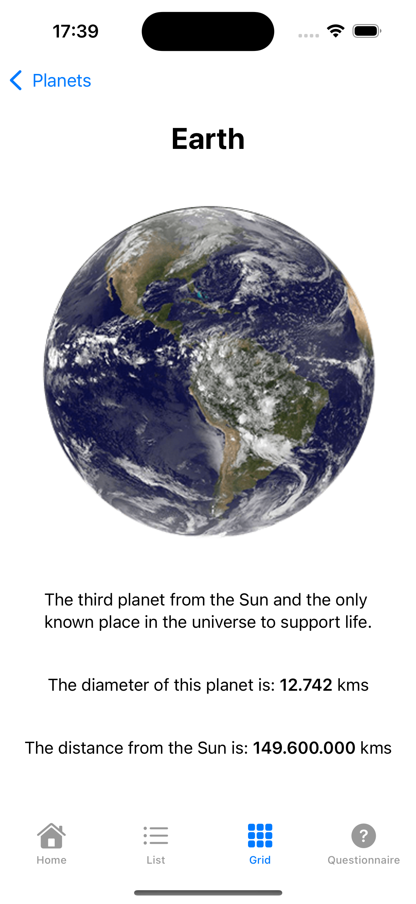
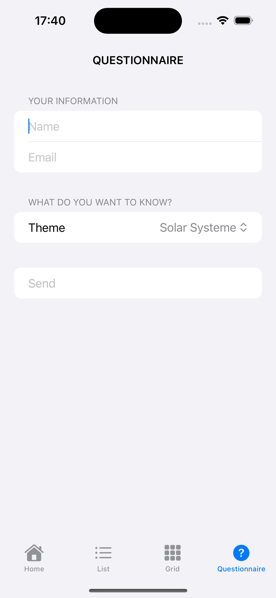
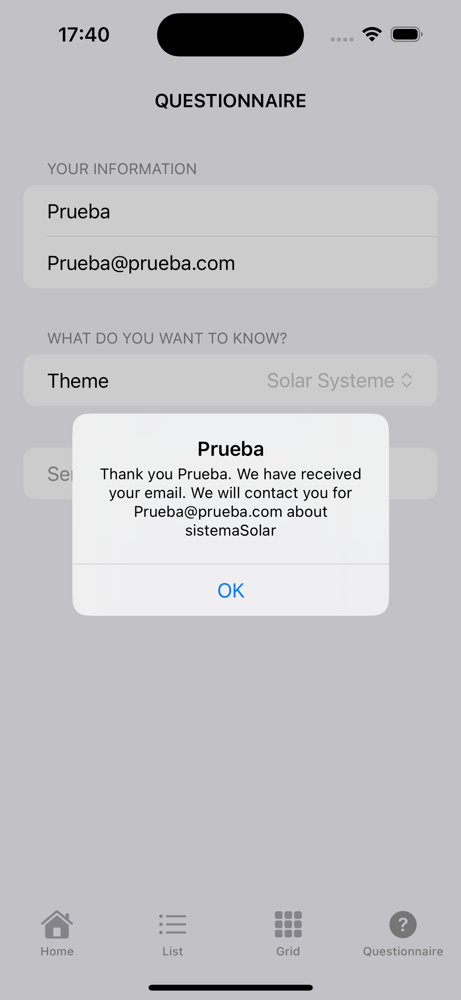

# 🌍 Planeta App

**Planeta** es una aplicación educativa que presenta de forma interactiva y visual los planetas del sistema solar. Está desarrollada en SwiftUI como proyecto de aprendizaje.

---

## ✨ Funcionalidades

- ✅ Lista horizontal de planetas con imágenes y nombres (scroll paginado).
- ✅ Vista detallada para cada planeta con información ampliada (mediante scroll home con sheet o listado y cuadrícula a una nueva vista).
- ✅ Animación visual de la distancia entre el Sol y la Tierra.
- ✅ Formulario de suscripción con validación de nombre y email.
- ✅ Selección de temas preferidos: planetas, lunas o sistema solar.
- ✅ Mensaje en alerta con nombre, email y tema elegido.
- ✅ Vista de partículas en movimiento y con cambio de color al hacer click.
- ✅ Diseño adaptado, colorido y amigable para jóvenes estudiantes.

---

## 🛠 Tecnologías

- SwiftUI
- MVVM simple
- Animaciones con `withAnimation` y `.animation`
- Validación con expresiones regulares
- `@FocusState` para navegación entre campos

---

## 📸 Capturas

| Pantalla principal | Pantalla listado | Pantalla cuadrícula |
|--------------------|------------------|----------------------|
|  |  |  |

| Pantalla detalle | Pantalla cuestionario | Pantalla mensaje |
|------------------|------------------------|------------------|
|  |  |  |

---

## 🚀 Futuras mejoras

- Añadir más cuerpos celestes (lunas, estrellas, cometas)
- Soporte para varios idiomas
- Base de datos local para guardar preguntas o favoritos

---

## 👨‍🚀 Autor

Proyecto creado por **Antonio Hernández Barbadilla** como parte de su formación en desarrollo de apps móviles.
